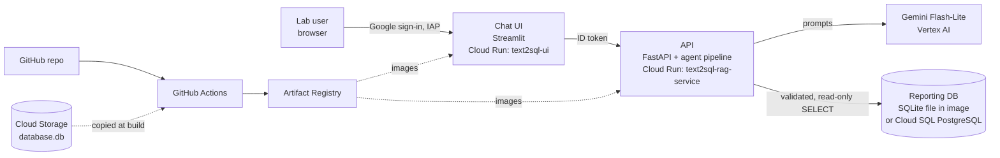

# ALS Publications Chat — Agentic Text-to-SQL Assistant

Ask questions about Advanced Light Source (ALS) publications in plain English, for example
*"How many refereed papers used beamline 7.0.1 in 2019?"* or *"List DOE high-impact papers with
Stanford authors"*. The assistant writes SQL, runs it on a read-only reporting database, and
answers with a sentence, the result table, the SQL it ran, and a CSV download.

## Purpose

Answering an ad-hoc question about ALS publications usually means writing a database query
or waiting for a report. This project is a proof of concept for self-service reporting: staff
ask a question, get an answer they can check (the SQL is always shown), and export the rows.

## What it demonstrates

- **An agentic LLM workflow for Text-to-SQL.** A fixed sequence of small prompts (rewrite,
  plan, write SQL, answer) with a self-correction loop: when a query fails, the error goes
  back to the model, which fixes it (up to 3 tries).
- **Guardrails outside the model.** Every query is parsed with `sqlglot` and rejected unless it
  is a single `SELECT` on allow-listed tables; it then runs on a read-only connection with a
  row cap (and a statement timeout on PostgreSQL).
- **A reporting database with no sensitive data.** `schema_catalog.py` lists the only tables and
  columns that may be loaded; the loader drops everything else.
- **Swappable backends.** The model (`LLM_BACKEND=vertex|local`) and the database
  (`DB_BACKEND=sqlite|postgres`) are chosen by environment variables, not code changes.
- **Low-cost, private deployment on Google Cloud.** Two Cloud Run services that scale to zero,
  Gemini Flash-Lite billed per token, CI/CD from GitHub Actions, and sign-in restricted to lab
  Google accounts through Identity-Aware Proxy (IAP).

## Architecture



| Component | Technology | Runs as | Notes |
| --- | --- | --- | --- |
| Chat UI | Streamlit (`ui.py`) | `text2sql-ui`, service account `pubschat-ui` | Keeps chat history in the browser session; behind IAP |
| API | FastAPI + Uvicorn (`main.py`) | `text2sql-rag-service`, service account `pubschat-api` | Private; only `pubschat-ui` may call it |
| LLM | Gemini on Vertex AI (`llm.py`) | called by the API | Model set by `GEMINI_MODEL`; no API key (service identity) |
| Database | SQLite or PostgreSQL (`db.py`) | bundled file, or Cloud SQL `pubs-reporting` | Read-only; schema from `schema_catalog.py` |
| CI/CD | GitHub Actions (`.github/workflows/deploy.yml`) | deployer service account (secret `GCP_SA_KEY`) | Builds, pushes and deploys on every push to `main` |

### How a question is answered

1. **Rewrite** (only with chat history): turns a follow-up like "and in 2020?" into a standalone question.
2. **Plan**: the model names the tables, joins, columns and filters it needs.
3. **Write SQL**: the model writes one query from the plan and the schema descriptions.
4. **Check and run**: `db.run_query` validates the SQL and runs it read-only. On any error the
   message is fed back to step 3 (max 3 attempts; then HTTP 500).
5. **Answer**: an empty result returns a fixed "no records" message; a one-row result is phrased
   as a sentence by the model; multi-row results are returned as a report table.

The response always includes `answer`, `columns`, `data` and `generated_sql`.

## Repository layout

```
main.py              FastAPI app: /health, /query and the agent pipeline
llm.py               LLM backends: Gemini on Vertex AI, or local Qwen (transformers)
db.py                SQLite / PostgreSQL access, SQL validation, read-only execution
schema_catalog.py    Allow-listed tables and columns, types, descriptions for prompts
load_data.py         CSV -> SQLite or PostgreSQL loader (drops non-catalog columns)
ui.py                Streamlit chat page
Dockerfile           API image (Gemini; no torch, no model weights)
Dockerfile.ui        UI image
requirements-api.txt API dependencies (pinned)
requirements-ui.txt  UI dependencies
requirements.txt     Local development, including the offline Qwen model
deploy/              One-time setup scripts and deployment notes
.github/workflows/   CI/CD to Cloud Run
```

Data files (`*.csv`, `*.db`) are not in this public repo; see `.gitignore`.

## Setup

### 1. Prepare the data (laptop)

Export the publications and authors tables to CSV (`PUBSJOURNALS.csv`, `AUTHORS.csv`) in a
`data/` folder next to this repo, then build the SQLite file:

```bash
python -m venv .venv && source .venv/bin/activate
pip install -r requirements-api.txt -r requirements-ui.txt
python load_data.py sqlite --data-dir ../data --db database.db
```

### 2. Run locally

```bash
gcloud auth application-default login
# terminal 1: API
LLM_BACKEND=vertex GOOGLE_CLOUD_PROJECT=als-user-office-software uvicorn main:app --port 8080
# terminal 2: UI
streamlit run ui.py            # http://localhost:8501
```

Offline alternative: `pip install -r requirements.txt` and `LLM_BACKEND=local` (downloads the
Qwen2.5-Coder-3B model, about 6 GB; slower and weaker SQL).

### 3. One-time Google Cloud setup

Requires the `gcloud` CLI, signed in as a project owner.

```bash
DEPLOYER_SA=<client_email from the GCP_SA_KEY JSON> ./deploy/setup_gcp.sh
```

This enables the Cloud Run, Artifact Registry, Vertex AI, IAP and storage APIs; creates the
`rag-repo` image repository, the `pubschat-api` and `pubschat-ui` service accounts and a private
bucket; grants the deployer its roles; and uploads `database.db` to the bucket.
Add the deployer's JSON key in GitHub as the repository secret `GCP_SA_KEY`.

### 4. Deploy

Push to `main` (or run the workflow manually). The workflow:

1. copies `database.db` from the bucket and builds the API and UI images;
2. pushes them to Artifact Registry, tagged with the commit SHA;
3. deploys the API (private, 512 MiB, scale to zero) and lets `pubschat-ui` call it;
4. deploys the UI behind IAP;
5. runs `/health` and one test question.

### 5. Give lab users access

```bash
./deploy/grant_lab_access.sh                                 # all lbl.gov accounts
MEMBERS="group:<team>@lbl.gov" ./deploy/grant_lab_access.sh  # or one Google group
```

Users open the UI's `https://...run.app` address and sign in with their lab Google account.
If the project is not inside the lab's Google Cloud organization, enable IAP once in the
console first (the script warns you).

### 6. Optional: Cloud SQL PostgreSQL instead of SQLite

```bash
./deploy/setup_cloudsql.sh      # creates the instance, database, IAM DB user; prints the load command
```

Load the data with the printed `load_data.py postgres ...` command, then set the GitHub
repository variable `DB_BACKEND=postgres` and re-run the workflow. Set it back to `sqlite`
to switch back. Details: `deploy/README.md`.

## Configuration

| Variable | Default | Used by | Meaning |
| --- | --- | --- | --- |
| `LLM_BACKEND` | `local` (image sets `vertex`) | API | `vertex` (Gemini) or `local` (Qwen) |
| `GEMINI_MODEL` | `gemini-3.5-flash-lite` | API | Vertex AI model ID |
| `GOOGLE_CLOUD_PROJECT`, `GOOGLE_CLOUD_LOCATION` | `als-user-office-software`, `global` | API | Vertex AI project and location |
| `DB_BACKEND` | `sqlite` | API | `sqlite` or `postgres` |
| `DB_PATH` | `database.db` | API | SQLite file |
| `CLOUDSQL_INSTANCE`, `DB_NAME`, `DB_USER` | — | API | Cloud SQL connection (IAM auth) |
| `MAX_ROWS`, `STATEMENT_TIMEOUT_MS` | `5000`, `10000` | API | Result cap and Postgres query timeout |
| `FASTAPI_URL`, `API_AUDIENCE` | `http://localhost:8080/query`, unset | UI | API address; audience for the ID token on Cloud Run |

## Cost

Both services scale to zero, so idle time costs nothing; Gemini is billed per token (fractions
of a cent per question). Cloud SQL, if used, is the only always-on charge (about $10/month for
`db-f1-micro`; pause it with `--activation-policy=NEVER`). Keep the Artifact Registry tidy with a
cleanup policy.

## Limitations

- Valid SQL can still answer a slightly different question; always check the SQL shown.
- Names must match stored values (no fuzzy matching of institutions or people yet).
- The whole schema goes into every prompt; fine for two tables, not for dozens.
- Data is a snapshot of the exports, and the current extract is complete only through 2020;
  counts for later years reflect incomplete data entry.
- Questions, the schema and one-row results are sent to Vertex AI (approved for this data).
- No accuracy benchmark yet.

## Roadmap

Tool-calling agent (list tables, look up values, run SQL), per-question schema selection for
larger schemas, coverage warnings for incomplete years, verified example queries, and an
evaluation set run in CI.
